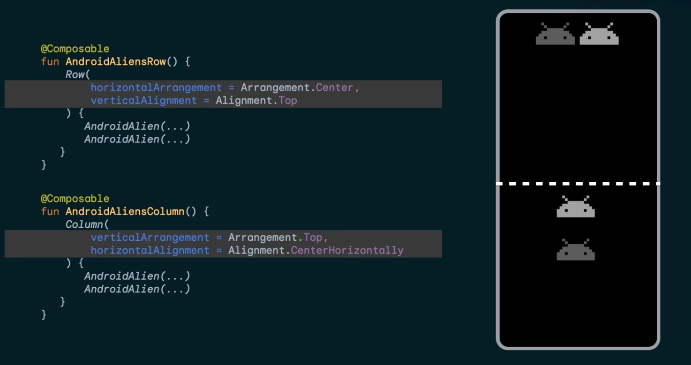
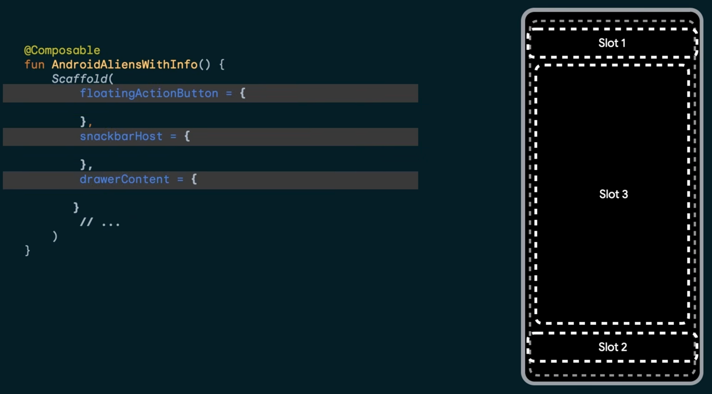

# Relevant command in kotlin multiplatform
./gradlew generateComposeResClass

./gradlew :shared:generateComposeResClass --rerun-tasks

Where the apk is built
/Users/jonathankee/AndroidStudioProjects/Survey/androidApp/build/outputs/apk/debug

# CI / CD for Kotlin multiplatform
Automating Kotlin Multiplatform Releases with GitHub Actions:
- https://www.youtube.com/watch?v=1Mcros96yEA&t=38s

# Resources to learn Kotlin UI
Download theme free
- https://material-foundation.github.io/material-theme-builder/

My first introduction Link:
- https://kotlinlang.org/docs/multiplatform/compose-multiplatform-explore-composables.html#implementing-composable-functions

The App() function is a regular Kotlin function annotated with @Composable. Such functions are referred to as composable functions or simply composables. They are the building blocks of a UI based on Jetpack Compose or Compose Multiplatform.

# Breakdown the syntax to prevent overwhelm
## Composable by order of importance
Video below show graphic explanation of Row & Column
- https://developer.android.com/develop/ui/compose/layouts/basics

Row - Under Layout
Column - Under Layout
[Scaffold](./screenshots/row&column.png)



Text
Surface
FlowRow
ElevatedButton

Scaffold:
[Scaffold](./screenshots/scaffold.png)



# My Notes
Where the main class is located:
shared/commonMain/kotlin/com/example/myapplication/App.kt

(Gemini on Lambda syntax):

In Kotlin and Jetpack Compose (which Kotlin Multiplatform uses for UI), MaterialTheme {} is a trailing lambda expression.

```kotlin 
// How you write it:
MaterialTheme {
// your UI components go here
}
```

```kotlin 
// What Kotlin is actually doing:
MaterialTheme.apply(content = {
// your UI components go here
})
```

Video on Lambda syntax:
- https://www.youtube.com/watch?v=wnyN8umZIRM

In Java:
```java
list.filter((it)-> it % 2 == 0)
```

In Kotlin:
```kotlin
list.filter{ it % 2 == 0 }
```

*** Kotlin offers a special syntax for passing functions as parameters to functions, when the last parameter is a function. ***

^
Used heavily in Jetpack Compose

```kotlin
QuickNotesAppTheme
```
 is a composable, the last parameter named "content" is a function. The type of "content" is @Composable() () -> Unit

```kotlin
Column
```
is a composable, the last parameter is a function. The type of "content" is @Composable ColumnScope.() -> Unit

I think why they can contain child is because of the last parameter

# Google official tutorial
Composable introduction (Important):
- https://developer.android.com/codelabs/basic-android-kotlin-compose-text-composables?continue=https%3A%2F%2Fdeveloper.android.com%2Fcourses%2Fpathways%2Fandroid-basics-compose-unit-1-pathway-3%23codelab-https%3A%2F%2Fdeveloper.android.com%2Fcodelabs%2Fbasic-android-kotlin-compose-text-composables#2

Jetpack Compose includes a wide range of built-in annotations, you have already seen @Composable and @Preview annotations so far in the course. You will learn more annotations and their usages in the latter part of the course.

Font size (Important)
- https://developer.android.com/codelabs/basic-android-kotlin-compose-text-composables?continue=https%3A%2F%2Fdeveloper.android.com%2Fcourses%2Fpathways%2Fandroid-basics-compose-unit-1-pathway-3%23codelab-https%3A%2F%2Fdeveloper.android.com%2Fcodelabs%2Fbasic-android-kotlin-compose-text-composables&utm_source=android-studio-app&utm_medium=app#5

Arrange the text elements in a row and column (Important)
- https://developer.android.com/codelabs/basic-android-kotlin-compose-text-composables?continue=https%3A%2F%2Fdeveloper.android.com%2Fcourses%2Fpathways%2Fandroid-basics-compose-unit-1-pathway-3%23codelab-https%3A%2F%2Fdeveloper.android.com%2Fcodelabs%2Fbasic-android-kotlin-compose-text-composables&utm_source=android-studio-app&utm_medium=app#7

The UI hierarchy is based on containment, meaning one component can contain one or more components, and the terms parent and child are sometimes used. The context here is that the parent UI elements contain children UI elements, which in turn can contain children UI elements. I

The three basic, standard layout elements in Compose are Column, Row, and Box composables. You learn more about the Box composable in the next codelab.

verticalArrangement, modifier, textAlign (Important)
- https://developer.android.com/codelabs/basic-android-kotlin-compose-text-composables?continue=https%3A%2F%2Fdeveloper.android.com%2Fcourses%2Fpathways%2Fandroid-basics-compose-unit-1-pathway-3%23codelab-https%3A%2F%2Fdeveloper.android.com%2Fcodelabs%2Fbasic-android-kotlin-compose-text-composables&utm_source=android-studio-app&utm_medium=app#8

verticalArrangement = Arrangement.Center
modifier = modifier.padding(8.dp)
modifier = Modifier.padding(16.dp).align(alignment = Alignment.End)
textAlign = TextAlign.Center

Link (Important):
- https://developer.android.com/courses/pathways/jetpack-compose-for-android-developers-1

Link (Important)
- https://developer.android.com/codelabs/jetpack-compose-basics?continue=https%3A%2F%2Fdeveloper.android.com%2Fcourses%2Fpathways%2Fjetpack-compose-for-android-developers-1%23codelab-https%3A%2F%2Fdeveloper.android.com%2Fcodelabs%2Fjetpack-compose-basics#6

# Productivity Hack
Ask AI how to translate html tags to compose multiplatform code
Just ask Gemini how to fix bug and make new features

# More resources to learn Kotlin / Kotlin Multiplatform
Straight to the point video on jetpack compose:
- https://www.youtube.com/@CodeWithFK/playlists
